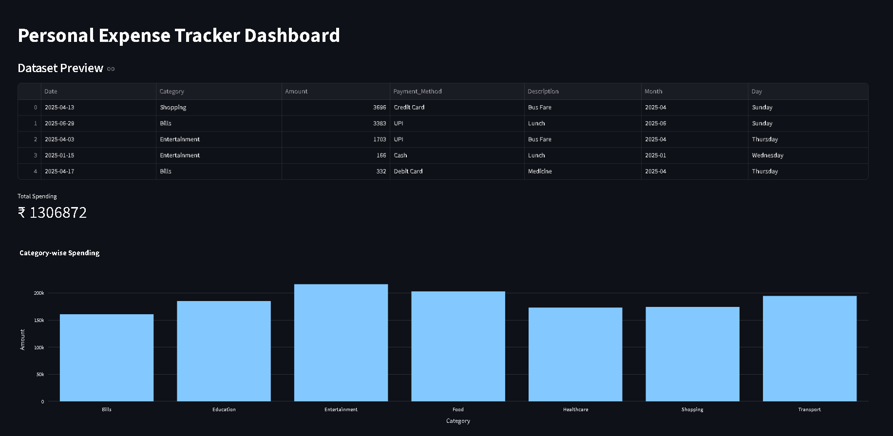
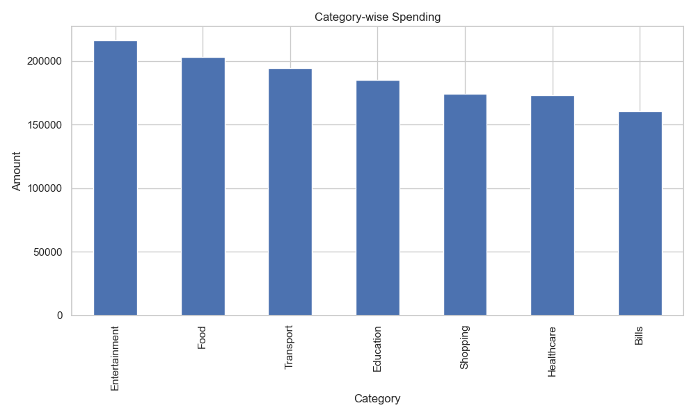
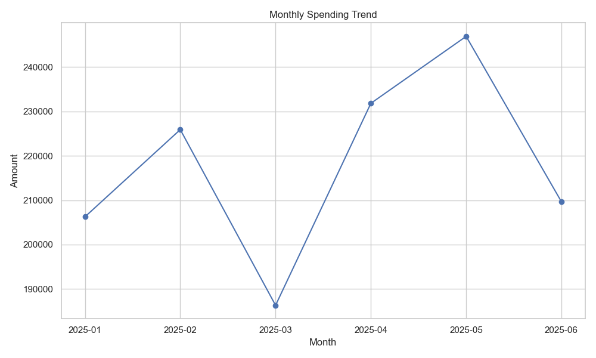
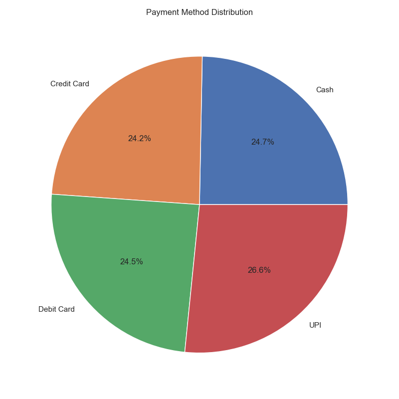
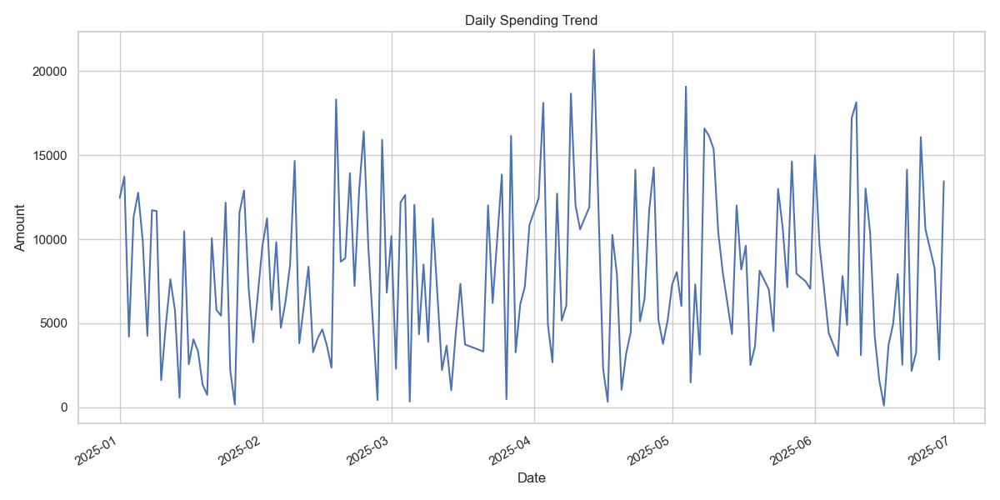

# 💰 Personal Expense Tracker


---

# 📌 Live Demo

## 🚀 Streamlit Deployment

👉 **Open Live Dashboard Here:**  

[Personal Expense Tracker Live App](https://personal-expense-tracker-kthpnnggxobkxznsv8cpoo.streamlit.app/?utm_source=chatgpt.com)

---

# 📂 GitHub Repository

👉 **View Source Code Here:**  

[GitHub Repository](https://github.com/Vayu-143/Personal-Expense-Tracker?utm_source=chatgpt.com)

---

# 📖 Project Overview

The **Personal Expense Tracker** is an industry-grade financial analytics and visualization system built using Python and modern data analysis libraries.

This project simulates a real-world finance analytics platform capable of:

- Expense Tracking
- Financial Analysis
- Budget Monitoring
- KPI Reporting
- Interactive Dashboards
- Spending Trend Visualization
- Automated Report Generation

The system uses **synthetic financial datasets** to simulate realistic user spending behavior and generate business intelligence insights. Expense tracking systems are widely used in personal finance management and business intelligence applications. :contentReference[oaicite:2]{index=2}

---

# 🎯 Project Objectives

The main goals of this project are:

✅ Track expenses efficiently  
✅ Analyze spending behavior  
✅ Identify high spending categories  
✅ Monitor monthly financial trends  
✅ Visualize financial data interactively  
✅ Generate automated reports  
✅ Build an industry-level Python portfolio project  

---

# 🚀 Features

## 📊 Analytics Features

- Category-wise Expense Analysis
- Monthly Spending Analysis
- Payment Method Distribution
- Top Expense Identification
- Budget Analysis
- Average Spending Metrics
- KPI Calculations

---

## 📈 Visualization Features

- Interactive Streamlit Dashboard
- Bar Charts
- Line Charts
- Pie Charts
- Daily Spending Trends
- Business Intelligence Style Visualizations

---

## ⚙️ System Features

- Synthetic Expense Dataset Generation
- Modular Project Architecture
- Logging System
- Report Generation
- CSV Data Processing
- Clean Data Pipeline
- Scalable Code Structure

---

# 🛠️ Tech Stack

| Technology | Purpose |
|---|---|
| Python | Core Programming |
| Pandas | Data Analysis |
| NumPy | Numerical Operations |
| Matplotlib | Static Visualization |
| Seaborn | Statistical Charts |
| Plotly | Interactive Charts |
| Streamlit | Dashboard Development |
| CSV | Data Storage |
| VS Code | Development Environment |
| Git & GitHub | Version Control |

---

# 🏗️ Project Architecture

```bash
Personal-Expense-Tracker/
│
├── app/
│   ├── analytics.py
│   ├── config.py
│   ├── dashboard.py
│   ├── data_loader.py
│   ├── report_generator.py
│   ├── utils.py
│   └── visualizer.py
│
├── data/
│   ├── raw/
│   └── processed/
│
├── images/
├── logs/
├── outputs/
├── reports/
├── tests/
│
├── main.py
├── streamlit_app.py
├── requirements.txt
├── README.md
└── .gitignore
```

---

# 🔄 Project Workflow

```text
Expense Data Generation
        ↓
Data Cleaning & Processing
        ↓
Financial Analytics
        ↓
Visualization Generation
        ↓
Dashboard Rendering
        ↓
Report Generation
        ↓
Business Insights
```

---

# 📊 Dashboard Preview

## 🖥️ Main Dashboard



---

# 📈 Visualization Outputs

## Category-wise Spending



---

## Monthly Spending Trend



---

## Payment Method Distribution



---

## Daily Spending Trend



---

# 📑 Generated Reports

The system automatically generates:

- Financial Reports
- Expense Summaries
- Spending Insights
- KPI Metrics
- Logs

Example output:

```text
Total Spending
Highest Spending Category
Budget Analysis
Average Expense
Overspending Detection
```

---

# ⚡ Installation Guide

## 1️⃣ Clone Repository

```bash
git clone https://github.com/Vayu-143/Personal-Expense-Tracker.git
```

---

## 2️⃣ Navigate to Project Folder

```bash
cd Personal-Expense-Tracker
```

---

## 3️⃣ Create Virtual Environment

### Windows

```bash
python -m venv venv
```

---

## 4️⃣ Activate Virtual Environment

### Windows

```bash
venv\Scripts\activate
```

---

## 5️⃣ Install Dependencies

```bash
pip install -r requirements.txt
```

---

# ▶️ How To Run

## Run Main Analytics Engine

```bash
python main.py
```

---

## Run Streamlit Dashboard

```bash
python -m streamlit run streamlit_app.py
```

---

# 📂 Generated Outputs

## 📁 Images

- category_chart.png
- monthly_chart.png
- payment_chart.png
- daily_chart.png
- dashboard.png

---

## 📁 Reports

- final_report.txt

---

## 📁 Logs

- project.log

---

# 📌 Business Use Cases

This project can be adapted for:

- Personal Finance Management
- Small Business Expense Tracking
- Budget Monitoring
- Financial Analytics
- Business Intelligence Dashboards
- Expense Forecasting Systems

Expense tracker and budgeting systems are widely used in modern finance applications and analytics dashboards. :contentReference[oaicite:3]{index=3}

---

# 🧠 Skills Demonstrated

This project demonstrates:

✅ Python Development  
✅ Data Analysis  
✅ Data Visualization  
✅ Dashboard Development  
✅ Financial Analytics  
✅ Business Intelligence  
✅ Report Automation  
✅ Software Architecture  
✅ GitHub Workflow  
✅ Problem Solving  

---

# 📚 Learning Outcomes

Through this project I learned:

- Real-world Python project structure
- Data cleaning and preprocessing
- Financial analytics workflows
- Dashboard engineering
- Interactive visualization systems
- Modular architecture design
- Report automation
- GitHub project management

---

# 🔮 Future Improvements

Planned future upgrades:

- SQLite Database Integration
- User Authentication System
- AI Expense Prediction
- Budget Alert Notifications
- Cloud Deployment
- PDF Report Export
- REST API Integration
- Multi-user Dashboard

---

# 👨‍💻 Author

## Vayunandan Mishra

### Connect With Me

- GitHub: [GitHub Profile](https://github.com/Vayu-143?utm_source=chatgpt.com)

---

# ⭐ If You Like This Project

Give this repository a ⭐ on GitHub.

---

# 📜 License

This project is licensed under the MIT License.